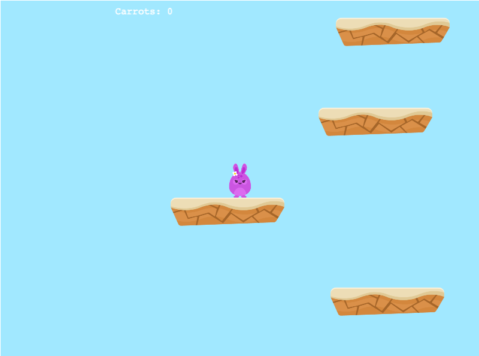

# Bunny Quest
> A Platform game made with the Phaser 3 framework

The goal is for the bunny to grab as many carrots as possible without falling off the platforms, the bunny is limited to two jumps per time.
The platforms disappear as soon as it is no longer in sight, so making the right move is important.

The game is over once the bunny falls off the platform.
Scores increase by 10 once you grab a carrot.

## Screenshot




## Game Instructions

- Move left with the  `left arrow`  key
- Move right with the  `right arrow`  key
- Jump with the  `Space`  key


## Built With

- Phaser 3
- HTML
- SCSS
- Javascript
- Webpack

## Live Demo

- [Bunny Quest Live](https://optimistic-ritchie-fde89a.netlify.app/)

## How to run this project on your local machine

### Prerequisites
- An internet browser
- NPM
- Phaser 3 

   
### Setup

1. Clone this repository by using the Terminal to navigate to the desired location on your computer and then enter the following line of code into the Terminal:
```
git@github.com:Maryjanee/Bunny-Quest.git
```
2. Run `cd Bunny-Quest` to move inside the downloaded repository.

3. The project contains a `package.json` file the manages its dependencies.Install them by running the command `npm install`.

4. Run  `npm start` to view the project in a web browser.
### Testing the game

1. Run `npm test` to run the tests

## Contributing

- To contribute to this project:
- Fork this repository & clone locally.
- Create an upstream remote and sync your local copy.
- create a new branch.
- Push your code to your origin repository.
- Create a new Pull Request .


Author

👤 **Maryjane Akpagbue**

- Github: [Maryjanee](https://github.com/Maryjanee)
- Twitter: [Maryjane Akpagbue](https://twitter.com/alfredmaryjane)
- Linkedin: [Maryjane Akpagbue](https://www.linkedin.com/in/maryjane-akpagbue)

## Show your support

Give a ⭐️ if you like this project!

## Acknowledgments
-  [Microverse](https:www.microverse.org)
-  [Open Game Art](https://opengameart.org/)